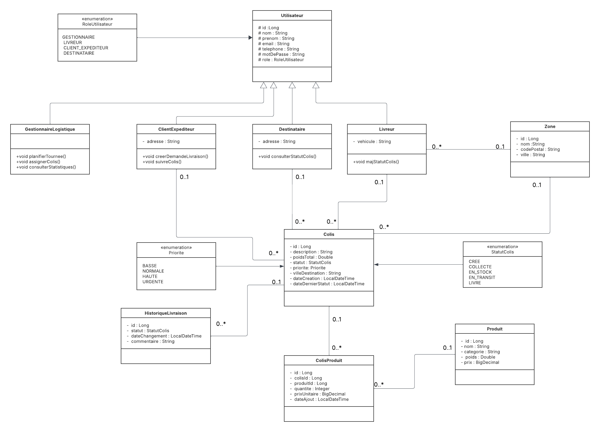

# 📦 SmartLogi Delivery Management System (SDMS)


> Système de gestion logistique moderne pour automatiser les opérations de livraison de colis au Maroc

---

## 📋 Table des matières

- [À propos du projet](#-à-propos-du-projet)
- [Contexte métier](#-contexte-métier)
- [Fonctionnalités principales](#-fonctionnalités-principales)
- [Technologies utilisées](#-technologies-utilisées)
- [Architecture](#-architecture)
- [Prérequis](#-prérequis)
- [Installation](#-installation)
- [Configuration](#-configuration)
- [Utilisation](#-utilisation)
- [API Documentation](#-api-documentation)
- [Modèle de données](#-modèle-de-données)
- [User Stories](#-user-stories)
- [Développement](#-développement)

---

## 🎯 À propos du projet

**SmartLogi Delivery Management System (SDMS)** est une application web moderne conçue pour automatiser et optimiser la gestion des opérations logistiques de la société SmartLogi, spécialisée dans la livraison de colis à travers le Maroc.

### Problématique

Actuellement, SmartLogi gère ses livraisons manuellement via des fichiers Excel et des registres papier, entraînant :
- ❌ Erreurs de saisie fréquentes
- ❌ Pertes de données
- ❌ Retards dans les livraisons
- ❌ Manque de visibilité sur le suivi des colis

### Solution

SDMS apporte une solution complète pour :
- ✅ Centraliser la gestion des clients, destinataires, colis et livreurs
- ✅ Assurer une traçabilité complète des colis
- ✅ Optimiser la planification logistique par zones géographiques
- ✅ Réduire les erreurs humaines
- ✅ Améliorer la fiabilité du suivi des livraisons

---

## 📖 Contexte métier

SmartLogi est une société spécialisée dans la livraison de colis à travers tout le Maroc. Le système gère le flux complet :

1. **Collecte** : Récupération des colis chez les clients expéditeurs
2. **Stockage** : Entreposage temporaire avant expédition
3. **Planification** : Organisation des tournées par zones géographiques
4. **Livraison** : Distribution aux destinataires finaux
5. **Traçabilité** : Historique complet de chaque étape

### Utilisateurs du système

| Rôle | Description |
|------|-------------|
| 👨‍💼 **Gestionnaire logistique** | Supervise toutes les opérations, planifie les tournées, gère les livreurs |
| 🚚 **Livreur** | Consulte ses colis assignés et met à jour les statuts |
| 📨 **Client expéditeur** | Crée des demandes de livraison et suit ses envois |
| 📦 **Destinataire** | Reçoit le colis et suit sa livraison |

---

## ⚡ Fonctionnalités principales

### Pour les Gestionnaires logistiques
- 📊 Tableau de bord avec vue synthétique des opérations
- 🗺️ Planification et assignation des tournées aux livreurs
- 🔍 Recherche avancée par mot-clé (nom, numéro, ville, etc.)
- 📈 Filtrage et pagination par statut, zone, ville, priorité, date
- 📦 Regroupement des colis par zone, statut ou priorité
- ⚖️ Calcul du poids total et nombre de colis par livreur/zone
- 🚨 Alertes pour les colis en retard ou prioritaires
- 📝 Gestion complète : ajout, modification, suppression
- 📜 Historique complet de chaque colis

### Pour les Livreurs
- 📋 Liste des colis assignés avec priorités et zones
- 🔄 Mise à jour des statuts en temps réel
- 🗺️ Organisation optimisée des tournées

### Pour les Clients expéditeurs
- 📤 Création de demandes de livraison
- 👀 Consultation de la liste des colis (en cours et livrés)
- 📧 Notifications par email (collecte, livraison)

### Pour les Destinataires
- 🔎 Consultation du statut des colis
- 📍 Suivi en temps réel de la livraison

---

## 🛠️ Technologies utilisées

### Backend
- **Framework** : Spring Boot 3.5.7
- **Langage** : Java 17
- **Build Tool** : Maven 3.9+
- **Base de données** : PostgreSQL 14+

### Librairies principales

| Technologie | Version | Usage |
|-------------|---------|-------|
| Spring Data JPA | 3.5.7 | Accès aux données et persistance |
| Spring Web | 3.5.7 | API REST et contrôleurs |
| Spring Validation | 3.5.7 | Validation des données |
| Liquibase | Latest | Gestion des migrations de base de données |
| MapStruct | 1.5.5 | Mapping entre entités et DTOs |
| Lombok | Latest | Réduction du code boilerplate |
| SpringDoc OpenAPI | 2.7.0 | Documentation API (Swagger) |
| SLF4J + Logback | 2.0.13 | Système de logs |
| PostgreSQL Driver | Latest | Connexion à PostgreSQL |

### Architecture et patterns
- 🏗️ Architecture en couches (Controller → Service → Repository)
- 🎯 DTO Pattern avec MapStruct
- 🛡️ Gestion centralisée des exceptions
- ✅ Validation des données avec Bean Validation
- 📄 Pagination et tri des résultats
- 📝 Logging structuré avec SLF4J

---

## 🏗️ Architecture

```
sdms/
├── src/
│   ├── main/
│   │   ├── java/com/smartlogi/sdms/
│   │   │   ├── SmartLogiDeliveryManagementSystemApplication.java
│   │   │   ├── config/           # Configuration (Swagger, App)
│   │   │   ├── controller/       # Contrôleurs REST
│   │   │   ├── dto/              # Data Transfer Objects
│   │   │   ├── entity/           # Entités JPA
│   │   │   ├── exception/        # Gestion des exceptions
│   │   │   ├── mapper/           # Mappers MapStruct
│   │   │   ├── repository/       # Repositories Spring Data
│   │   │   └── service/          # Logique métier
│   │   └── resources/
│   │       ├── application.yml   # Configuration principale
│   │       ├── logback-spring.xml # Configuration logs
│   │       └── db/changelog/     # Scripts Liquibase
│   └── test/                     # Tests unitaires et intégration
├── docs/                         # Documentation
│   ├── diagramme_classes.png     # Diagramme UML
│   └── diagramme_classes.pdf
├── logs/                         # Fichiers de logs
├── pom.xml                       # Configuration Maven
└── README.md                     # Ce fichier
```

### Flux de données

```
Client HTTP
    ↓
Controller (Validation)
    ↓
Service (Logique métier)
    ↓
Repository (Accès données)
    ↓
PostgreSQL Database
```

---

## 📋 Prérequis

Avant d'installer le projet, assurez-vous d'avoir :

- ☕ **Java JDK 17** ou supérieur
- 🐘 **PostgreSQL 14** ou supérieur
- 📦 **Maven 3.9** ou supérieur (ou utilisez le wrapper `mvnw` inclus)
- 🔧 **Git** pour cloner le projet
- 💻 **IDE recommandé** : IntelliJ IDEA, Eclipse, ou VS Code

### Vérification des versions

```bash
# Java
java -version
# Doit afficher : openjdk version "17" ou supérieur

# PostgreSQL
psql --version
# Doit afficher : psql (PostgreSQL) 14 ou supérieur

# Maven (optionnel)
mvn -version
# Doit afficher : Apache Maven 3.9 ou supérieur
```

---

## 🚀 Installation

### 1. Cloner le repository

```bash
git clone https://github.com/HamzaBraik01/smartlogi-sdms.git
cd sdms
```

### 2. Configurer la base de données PostgreSQL

#### Créer la base de données

```sql
-- Se connecter à PostgreSQL
psql -U postgres

-- Créer la base de données
CREATE DATABASE smartlogi_management;

-- Se connecter à la base
\c smartlogi_management

-- Vérifier la connexion
\l
```

#### Créer l'utilisateur (optionnel)

```sql
-- Créer un utilisateur dédié
CREATE USER smartlogi WITH PASSWORD 'votre_mot_de_passe';

-- Donner les privilèges
GRANT ALL PRIVILEGES ON DATABASE smartlogi_management TO smartlogi;
```

### 3. Configurer l'application

Éditez le fichier `src/main/resources/application.yml` :

```yaml
spring:
  datasource:
    url: jdbc:postgresql://localhost:5432/smartlogi_management
    username: postgres          # Votre utilisateur PostgreSQL
    password: ADMIN            # Votre mot de passe PostgreSQL
    driver-class-name: org.postgresql.Driver
```

### 4. Installer les dépendances

```bash
# Avec Maven wrapper (recommandé)
./mvnw clean install

# Ou avec Maven global
mvn clean install
```

### 5. Exécuter les migrations Liquibase

Les migrations Liquibase s'exécutent automatiquement au démarrage de l'application. Elles créent :
- Les tables de la base de données
- Les contraintes et index
- Les données de test initiales

---

## ⚙️ Configuration

### Fichier application.yml

```yaml
spring:
  # Configuration de la base de données
  datasource:
    url: jdbc:postgresql://localhost:5432/smartlogi_management
    username: postgres
    password: ADMIN
    driver-class-name: org.postgresql.Driver

  # Configuration JPA/Hibernate
  jpa:
    hibernate:
      ddl-auto: none              # Liquibase gère le schéma
    show-sql: true                # Affiche les requêtes SQL
    properties:
      hibernate:
        format_sql: true          # Formate les requêtes SQL

  # Configuration Liquibase
  liquibase:
    change-log: classpath:db/changelog/changelog-master.xml
    enabled: true

# Configuration Swagger/OpenAPI
springdoc:
  api-docs:
    path: /v3/api-docs
    enabled: true
  swagger-ui:
    path: /swagger-ui.html
    enabled: true
  show-actuator: true
  default-consumes-media-type: application/json
  default-produces-media-type: application/json

# Configuration du serveur
server:
  port: 8080

# Configuration des logs
logging:
  level:
    com.smartlogi.sdms: DEBUG
    org.springframework: INFO
  file:
    name: logs/smartlogi.log
```

### Variables d'environnement (Production)

Pour la production, utilisez des variables d'environnement :

```bash
export DB_HOST=localhost
export DB_PORT=5432
export DB_NAME=smartlogi_management
export DB_USER=postgres
export DB_PASSWORD=your_secure_password
export SERVER_PORT=8080
```

---

## 💻 Utilisation

### Démarrer l'application

#### Option 1 : Avec Maven wrapper (recommandé)

```bash
# Windows
mvnw.cmd spring-boot:run

# Linux/Mac
./mvnw spring-boot:run
```

#### Option 2 : Avec Maven global

```bash
mvn spring-boot:run
```

#### Option 3 : Depuis l'IDE

1. Ouvrir le projet dans IntelliJ IDEA / Eclipse
2. Localiser `SmartLogiDeliveryManagementSystemApplication.java`
3. Clic droit → Run

#### Option 4 : Avec le JAR compilé

```bash
# Compiler le JAR
mvn clean package -DskipTests

# Exécuter le JAR
java -jar target/sdms-0.0.1-SNAPSHOT.jar
```

### Script de démarrage rapide

Utilisez le script fourni :

```bash
# Windows
start-with-fix.cmd

# Linux/Mac
chmod +x start.sh
./start.sh
```

### Vérifier que l'application fonctionne

L'application démarre sur **http://localhost:8080**

```bash
# Test de santé
curl http://localhost:8080/actuator/health

# Devrait retourner : {"status":"UP"}
```

---

## 📚 API Documentation

### Swagger UI (Interface graphique)

Une fois l'application démarrée, accédez à la documentation interactive :

🔗 **http://localhost:8080/swagger-ui/index.html**

L'interface Swagger permet de :
- 📖 Consulter tous les endpoints disponibles
- 🧪 Tester les API directement depuis le navigateur
- 📝 Voir les schémas des requêtes et réponses
- ✅ Valider les données

### OpenAPI JSON

Pour obtenir la spécification OpenAPI au format JSON :

🔗 **http://localhost:8080/v3/api-docs**

### Endpoints principaux

| Ressource | Endpoint | Méthodes |
|-----------|----------|----------|
| Clients expéditeurs | `/api/clients-expediteurs` | GET, POST, PUT, DELETE |
| Destinataires | `/api/destinataires` | GET, POST, PUT, DELETE |
| Colis | `/api/colis` | GET, POST, PUT, DELETE |
| Livreurs | `/api/livreurs` | GET, POST, PUT, DELETE |
| Zones | `/api/zones` | GET, POST, PUT, DELETE |
| Produits | `/api/produits` | GET, POST, PUT, DELETE |
| Historique | `/api/historique-livraisons` | GET, POST |

### Exemples de requêtes

#### Créer un colis

```bash
curl -X POST http://localhost:8080/api/colis \
  -H "Content-Type: application/json" \
  -d '{
    "description": "Colis urgent",
    "poids": 2.5,
    "statut": "CREE",
    "priorite": "HAUTE",
    "villeDestination": "Casablanca",
    "idClientExpediteur": 1,
    "idDestinataire": 2,
    "idZone": 1
  }'
```

#### Récupérer tous les colis (avec pagination)

```bash
curl "http://localhost:8080/api/colis?page=0&size=10&sort=dateCreation,desc"
```

#### Rechercher des colis par statut

```bash
curl "http://localhost:8080/api/colis?statut=EN_TRANSIT"
```

---

## 🗄️ Modèle de données

### Diagramme de classes UML



### Entités principales

#### ClientExpéditeur
```java
- id : Long
- nom : String
- prenom : String
- email : String
- telephone : String
- adresse : String
- dateInscription : LocalDateTime
```

#### Destinataire
```java
- id : Long
- nom : String
- prenom : String
- email : String
- telephone : String
- adresse : String
```

#### Colis
```java
- id : Long
- description : String
- poids : Double
- statut : StatutColis (CREE, COLLECTE, EN_STOCK, EN_TRANSIT, LIVRE)
- priorite : Priorite (BASSE, NORMALE, HAUTE, URGENTE)
- villeDestination : String
- dateCreation : LocalDateTime
- dateLivraisonPrevue : LocalDateTime
- dateLivraisonReelle : LocalDateTime
- clientExpediteur : ClientExpéditeur
- destinataire : Destinataire
- livreur : Livreur
- zone : Zone
```

#### Livreur
```java
- id : Long
- nom : String
- prenom : String
- telephone : String
- vehicule : String
- zoneAssignee : String
- disponible : Boolean
```

#### Zone
```java
- id : Long
- nom : String
- codePostal : String
- ville : String
- region : String
```

#### HistoriqueLivraison
```java
- id : Long
- colis : Colis
- statut : StatutColis
- dateChangement : LocalDateTime
- commentaire : String
- utilisateur : String
```

#### Produit
```java
- id : Long
- nom : String
- categorie : String
- poids : Double
- prix : BigDecimal
- description : String
```

#### Colis_Produit (Table de liaison)
```java
- idColis : Long
- idProduit : Long
- quantite : Integer
- prixUnitaire : BigDecimal
- dateAjout : LocalDateTime
```

---

## 👥 User Stories

### Client expéditeur

- ✅ Je veux créer une demande de livraison pour envoyer un colis à un destinataire
- ✅ Je veux consulter la liste de mes colis en cours et livrés pour suivre mes envois
- 📧 Je veux recevoir une notification par email lorsque mon colis est collecté ou livré (bonus)

### Destinataire

- ✅ Je veux consulter le statut de colis qui me sont destinés afin de savoir quand les recevoir

### Livreur

- ✅ Je veux voir la liste de mes colis assignés, avec leurs priorités et zones
- ✅ Je veux mettre à jour le statut des colis au fur et à mesure de la collecte et de la livraison

### Gestionnaire logistique

- ✅ Je veux voir toutes les demandes de livraison et les assigner aux livreurs pour planifier les tournées
- ✅ Je veux corriger ou supprimer des informations erronées sur un colis, client ou destinataire
- ✅ Je veux filtrer et paginer les colis par statut, zone, ville, priorité ou date
- ✅ Je veux regrouper les colis par zone, statut ou priorité pour avoir une vue synthétique
- ✅ Je veux pouvoir rechercher un colis, un client ou un livreur par mot-clé
- ✅ Je veux calculer le poids total et le nombre de colis par livreur et par zone
- 🚨 Je veux identifier les colis en retard ou prioritaires et recevoir une alerte par email
- ✅ Je veux associer plusieurs produits à un colis pour gérer les colis multi-produits
- ✅ Je veux consulter l'historique complet d'un colis, avec toutes les étapes et commentaires

---

## 🔧 Développement

### Structure du projet

Le projet suit l'architecture en couches de Spring Boot :

```
Controller (REST API)
    ↓
Service (Logique métier)
    ↓
Repository (Accès données)
    ↓
Database (PostgreSQL)
```

### Bonnes pratiques appliquées

1. **Séparation des responsabilités** : Chaque couche a un rôle précis
2. **DTO Pattern** : Les entités ne sont jamais exposées directement
3. **Validation** : Utilisation de `@Valid`, `@NotNull`, `@Size`, etc.
4. **Gestion des exceptions** : Gestionnaire centralisé avec `@ControllerAdvice`
5. **Pagination** : Toutes les listes utilisent `Pageable`
6. **Logging** : SLF4J pour tracer les actions importantes
7. **Documentation** : Swagger/OpenAPI pour documenter l'API
8. **Migrations** : Liquibase pour versionner le schéma de base de données

### Ajouter une nouvelle entité

1. Créer l'entité dans `entity/`
2. Créer le DTO dans `dto/`
3. Créer le mapper dans `mapper/`
4. Créer le repository dans `repository/`
5. Créer le service dans `service/`
6. Créer le controller dans `controller/`
7. Ajouter le changelog Liquibase dans `db/changelog/`

### Logs

Les logs sont configurés dans `logback-spring.xml` :

- **Console** : Tous les logs de niveau INFO et supérieur
- **Fichier** : `logs/smartlogi.log` avec rotation quotidienne
- **Format** : Timestamp, Niveau, Thread, Logger, Message

```bash
# Consulter les logs en temps réel
tail -f logs/smartlogi.log

# Rechercher des erreurs
grep ERROR logs/smartlogi.log
```

---

<div align="center">

**Développé avec ❤️ par [Hamza Braik](https://github.com/HamzaBraik01/smartlogi-sdms)**

[⬆ Retour en haut](#-smartlogi-delivery-management-system-sdms)

</div>

